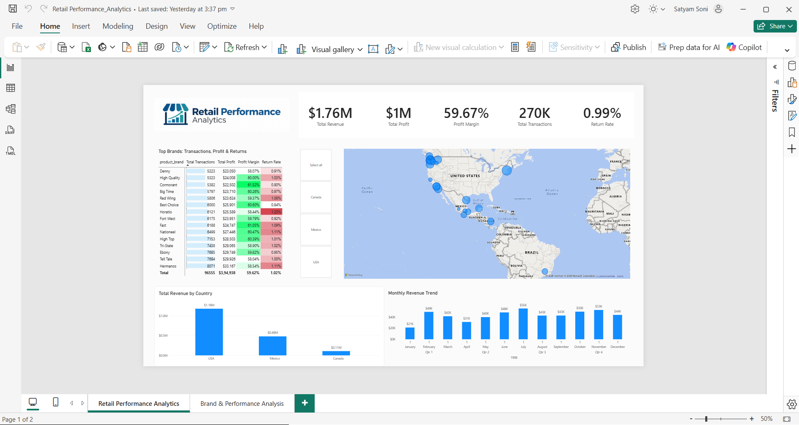
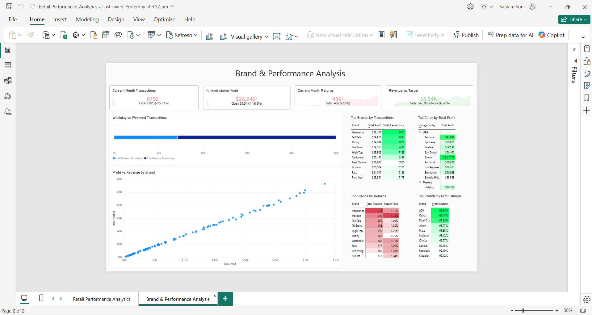
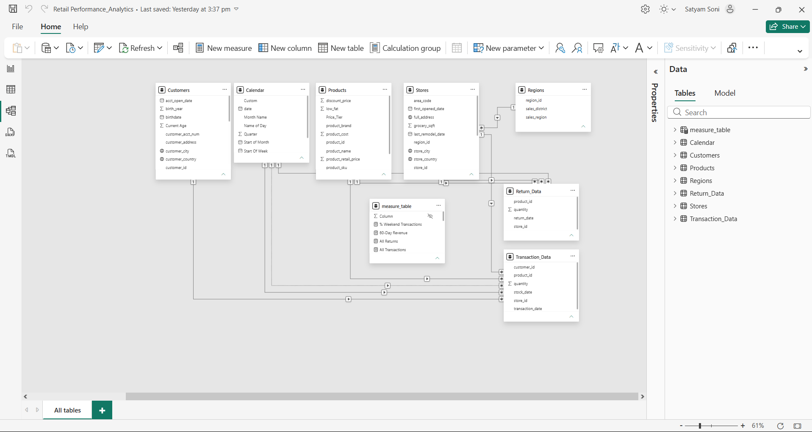

# Retail Performance Analytics

A Power BI retail analytics project focused on **revenue, profitability, brand performance, returns, transactions, and geographic performance**.



---

## Project Overview

This project analyzes retail performance using Power BI and DAX.

The objective was to build an interactive business intelligence report that allows users to evaluate:

- Revenue performance
- Profitability
- Profit margin
- Transaction volume
- Return rates
- Brand performance
- Geographic performance
- Revenue targets
- Weekday vs weekend customer activity

The report was redesigned from a guided learning project into a more customized portfolio project with a new layout, branding, visual structure, and analytical focus.

---

## Dataset

This project uses the **Maven Market retail dataset**.

The dataset contains information related to:

- Customers
- Products
- Transactions
- Returns
- Stores
- Geographic locations
- Calendar dates

The original dataset was provided as part of Maven Analytics training material.

The report shown here was subsequently redesigned and extended with:

- Custom branding
- New report structure
- New visual arrangement
- Additional comparative analysis
- Custom KPI presentation
- Brand-focused performance analysis

---

## Tech Stack

- Power BI Desktop
- DAX
- Power Query
- Data Modeling
- GitHub

---

## Business Questions

The analysis was designed to answer questions such as:

- How much revenue and profit does the business generate?
- What is the overall profit margin?
- How many transactions occur across the business?
- What percentage of transactions result in returns?
- Which brands generate the highest transaction volume?
- Which brands have the strongest profit margins?
- Which brands experience the highest return volumes?
- Which cities generate the most profit?
- How does performance differ across countries?
- How does revenue change throughout the year?
- How much customer activity occurs on weekdays versus weekends?
- How does current performance compare with defined business targets?

---

# Dashboard

The report contains two main analytical pages.

---

## 1. Executive Overview


The Executive Overview provides a high-level summary of overall retail performance.

### Key metrics include:

- Total Revenue
- Total Profit
- Profit Margin
- Total Transactions
- Return Rate

### Main analysis includes:

- Top brands by transactions, profit, margin, and return rate
- Geographic distribution of transactions
- Revenue by country
- Monthly revenue trend

This page is designed to provide a quick understanding of overall commercial performance.

---

## 2. Brand & Performance Analysis



This page focuses on deeper analysis of brand performance and operational outcomes.

### Analysis includes:

- Current Month Transactions vs Target
- Current Month Profit vs Target
- Current Month Returns vs Target
- Revenue vs Target
- Weekday vs Weekend Transactions
- Profit vs Revenue by Brand
- Top Brands by Transactions
- Top Brands by Profit Margin
- Top Brands by Returns
- Top Cities by Profit

The page allows users to compare high-performing brands with brands showing higher return activity or lower profitability.

---

## Data Model



The Power BI model uses a structured star-style design with related tables for:

- Calendar
- Customers
- Products
- Stores
- Transactions
- Returns

A dedicated measures table is used to organize DAX measures and keep analytical logic separate from raw data fields.

---

# Key KPIs

| Metric | Result |
|---|---:|
| Total Revenue | ~$1.76M |
| Total Profit | ~$1.00M |
| Profit Margin | ~59.67% |
| Total Transactions | ~270K |
| Return Rate | ~0.99% |

---

# Key Findings

## 1. Overall profitability is strong

The business generated approximately **$1.76M in revenue** with approximately **$1M in profit**, resulting in a profit margin close to **60%**.

This indicates strong overall profitability within the observed dataset.

---

## 2. Brand performance varies significantly

Brands differ meaningfully across:

- Transaction volume
- Total profit
- Profit margin
- Return rate

A brand with high transaction volume is not necessarily the brand with the highest profit margin.

This makes multi-metric brand analysis more useful than ranking products using only sales volume.

---

## 3. Revenue is geographically concentrated

The USA contributes the largest share of observed revenue, followed by Mexico and Canada.

Geographic concentration suggests that country-level performance should be monitored independently rather than relying only on global totals.

---

## 4. Monthly revenue fluctuates throughout the year

Monthly revenue shows noticeable variation across the calendar year.

This highlights the importance of monitoring seasonal or monthly performance patterns rather than evaluating results using annual totals alone.

---

## 5. Weekday transactions dominate

The majority of transactions occur during weekdays rather than weekends.

This suggests that customer activity is significantly concentrated during normal working-week periods.

---

## 6. High-profit brands are not always the highest-margin brands

The Profit vs Revenue analysis shows a strong relationship between scale and profitability, while the margin analysis reveals brands that achieve stronger efficiency even at lower transaction volumes.

This distinction helps separate:

- High-volume brands
- High-profit brands
- High-margin brands

---

## 7. Returns vary by brand

Some brands show higher absolute return volumes and return rates than others.

Return analysis should therefore be considered alongside transaction and profitability metrics when evaluating overall brand performance.

---

# Business Recommendations

### Monitor high-volume and high-margin brands separately

Brands should not be ranked using a single measure.

A balanced view should include:

- Transaction volume
- Profit
- Profit margin
- Return rate

---

### Investigate brands with elevated returns

Brands with higher return volumes or return rates may require deeper investigation into:

- Product quality
- Customer expectations
- Product positioning
- Fulfillment issues

---

### Use geographic performance for planning

Country and city-level profitability can help guide:

- Sales focus
- Store strategy
- Marketing allocation
- Regional performance monitoring

---

### Track performance against targets

Current-month KPI comparisons should be monitored regularly to identify underperformance early and support corrective action.

---

### Consider weekday behavior in operational planning

Because transaction activity is concentrated on weekdays, staffing, promotions, and operational capacity can be planned around observed customer demand patterns.

---

# DAX Measures

The project uses DAX measures including:

- Total Revenue
- Total Profit
- Profit Margin
- Total Transactions
- Total Returns
- Return Rate
- Current Month Revenue
- Current Month Profit
- Current Month Transactions
- Current Month Returns
- Revenue Target
- YTD Revenue
- 60-Day Revenue
- Weekend Transactions
- Weekday Transactions
- Percentage of Weekend Transactions

A dedicated measure table is used to organize calculations within the Power BI model.

---

# Power BI Features Used

This project demonstrates experience with:

- Data modeling
- Table relationships
- DAX measures
- KPI cards
- Conditional formatting
- Geographic visualization
- Scatter plots
- Ranking tables
- Monthly trend analysis
- Target comparisons
- Slicers and report filtering
- Data visualization design

---

# Repository Structure

```text
retail-performance-analytics/
│
├── README.md
│
│
└── screenshots/
    ├── 01_executive_overview.png
    ├── 02_brand_performance_analysis.png
    └── 03_data_model.png
```

---

# Limitations

- This project uses a training dataset rather than live production data.
- The available data represents a predefined historical period.
- Business targets included in the model originate from the supplied dataset/project structure.
- Observed trends should not automatically be interpreted as future performance.
- Geographic and customer behavior findings are limited to the available dataset.
- This project was originally developed from a guided Maven Analytics learning exercise and was later redesigned and extended for portfolio use.

---

# What I Learned

This project provided practical experience with:

- Power BI report development
- DAX
- Data modeling
- KPI design
- Brand-level profitability analysis
- Return analysis
- Target comparison
- Geographic analysis
- Dashboard redesign
- Turning a guided project into a more independent analytical portfolio piece

---

## Author

**Satyam Soni**

Data Analytics Portfolio Project
